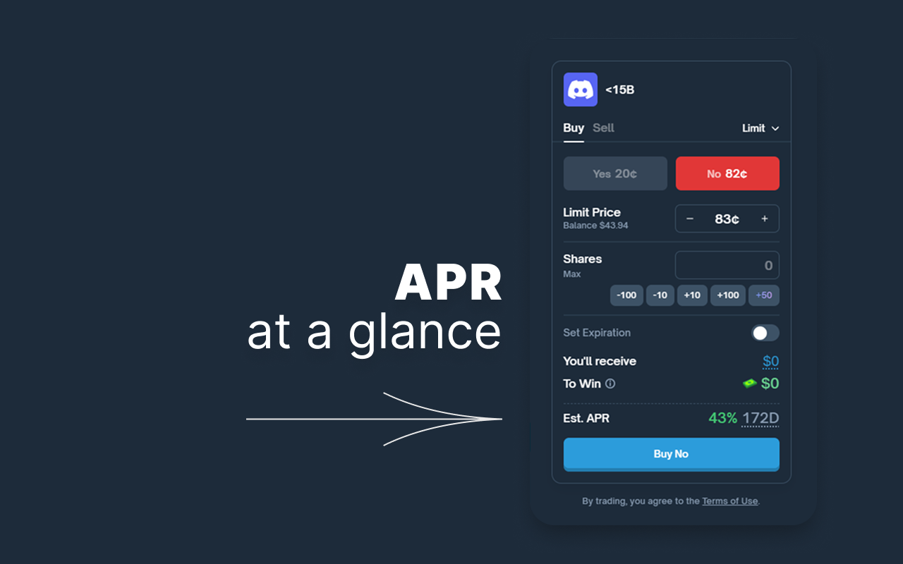

# Polymarket APR

Chrome extension that adds a native-style APR (Annual Percentage Rate) block to the Polymarket trade widget.

## Preview

## Install

The latest Chrome version is available in the Chrome Web Store:

[Chrome Web Store listing](https://chromewebstore.google.com/detail/polymarket-apr/dainflhaaolcjggcopmjhpaodnleicib)

## Local Installation

1. Open `chrome://extensions`.
2. Enable Developer mode.
3. Click "Load unpacked".
4. Select the `polymarket-apr/` folder from this repository.

## Repository Structure

- `polymarket-apr/` - extension source used for development and testing
- `dev/` - local userscript workflow files for fast visual iteration
- `releases/` - release metadata/docs (ZIP binaries are published as GitHub Release assets)
- `pictures/` - icons, screenshots, and promo assets

## Development Workflow

See [CONTRIBUTING.md](CONTRIBUTING.md) for the full development workflow (including visual dev cycle and pre-commit visual gate), plus branching, versioning, and release flow.
